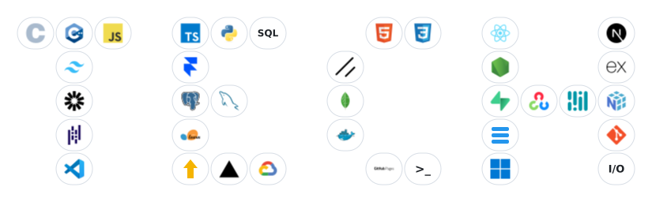

<h2 align="center">Turning curiosity into working software ✨</h2>

  Currently doing my <b>B.Tech in Computer Science & Engineering</b> at <b>REVA University</b> 🎓

  

A little bit of everything I build with 👇

  

  

🏆 <b>My first hackathon win — FileMind</b> <i>(Botathon 2026)</i>

  A codebase investigation agent that explores code the way a curious engineer would — 
  it walks the file tree, follows the imports, and points you to the exact files it read. 
  Works on your local project or any public GitHub repo.

  <a href="https://botathon-nine.vercel.app/"><b>🔗 Try it live</b></a> &nbsp;·&nbsp;
  <a href="https://github.com/Shashank-U-04/botathon"><b>💻 Peek at the code</b></a>

  

I'd love to chat 👋

  <a href="mailto:shashank.u.shashu1359@gmail.com"><b>✉ Email</b></a> &nbsp;·&nbsp;
  <a href="https://www.linkedin.com/in/shashank-u-016b54330/"><b>💼 LinkedIn</b></a> &nbsp;·&nbsp;
  <a href="https://github.com/Shashank-U-04"><b>🧑‍💻 GitHub</b></a>

